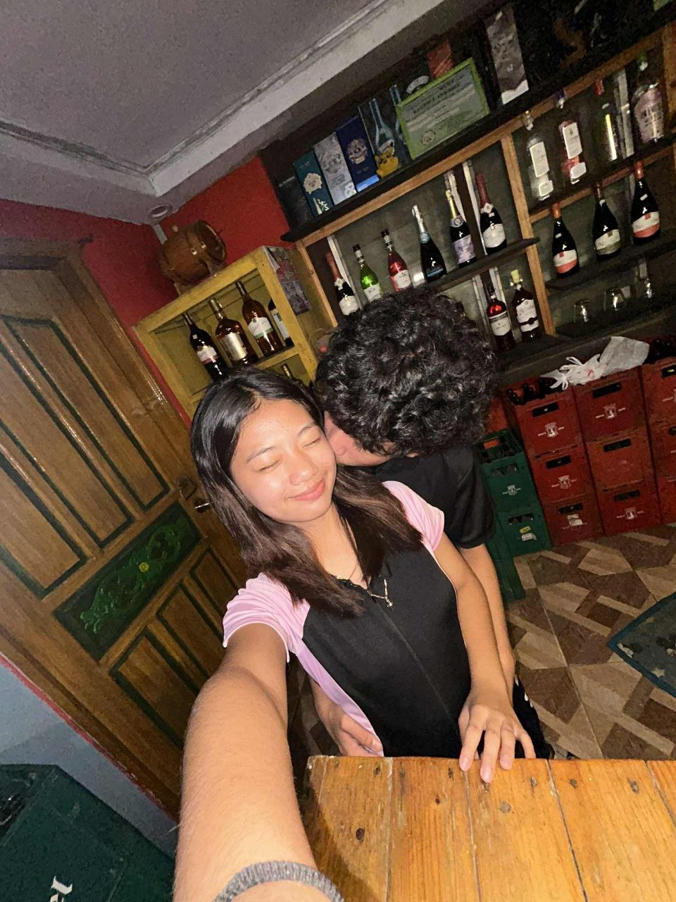

<head>
<meta charset="utf-8" />
<meta name="viewport" content="width=device-width,initial-scale=1" />
<title>For You — ♡</title>

</head>
<body>
<audio id="mySong" src="thal2.mp3" autoplay></audio>

  

    

      <h1>Hello, love!!  — Happy 18th birthday enjoy your day love iloveyou🎈🎂 ❤️</h1>
      
A little message for you okay?✨

      
Hi lovelove, today isn’t just another day — it’s your day. The day the world became brighter, more beautiful, and more meaningful because you were born. Happy 18th birthday to the most amazing girl in my life, the one who owns my heart completely. Eighteen years ago, someone truly special came into this world someone who would one day become my everything. And now that day has come, and I get to stand beside you as you step into adulthood. I can’t even put into words how proud, grateful, and happy I am to see the person you’ve become. You’re not just growing older, my love you’re growing more beautiful inside and out, wiser, stronger, and even more extraordinary. You have no idea how much you mean to me. You’ve brought light into my darkest days, laughter into my quiet moments, and comfort into my storms. Every time I look at you, I see the reason I smile, the reason I keep going, and the reason I believe in love. You’ve changed my life in so many ways — your kindness, your patience, your love, and your understanding have made me a better person. You’ve always been someone who cares deeply, who loves purely, and who gives her all to the people she loves. You have this rare kind of soul gentle but strong, soft but brave, simple but full of magic. You’re not just beautiful because of how you look, but because of who you are your heart, your thoughts, your dreams, your laughter, your strength, your love. Everything about you amazes me. Now that you’re 18, a new chapter of your life begins one filled with dreams, challenges, adventures, and countless memories waiting to be made. I know that sometimes life can be unpredictable, but please remember that you are capable of anything. You are destined for great things, my love. Don’t ever doubt yourself, because I’ve seen the fire in your heart, the determination in your eyes, and the courage in your soul. I’ll always be here not just as your boyfriend, but as your biggest supporter, your number one fan, your safe place, and your partner in everything. I’ll celebrate every win with you, hold your hand through every challenge, and remind you how incredible you are whenever you forget. You’ll never have to face this world alone, because I’ll be right here cheering you on, loving you endlessly, and believing in you always.

  

      

        <button id="surpriseBtn">Another message</button>
        <button onclick="playSong()">Play Song</button>
        <button>My Question</button>
        <button id="loveBtn">Love</button>
      

      <footer>Happy birthday!!</footer>
    

    <aside class="side photo">
      
      
Look, you're so beautiful ✨

    </aside>
  

<!-- Envelope -->

  

    

    

  

<!-- Floating letter -->

</body>

